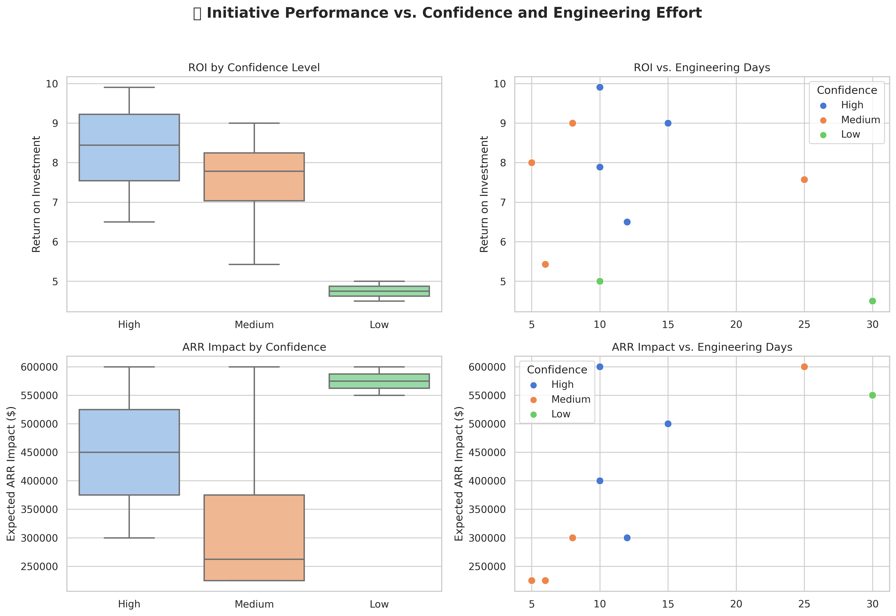
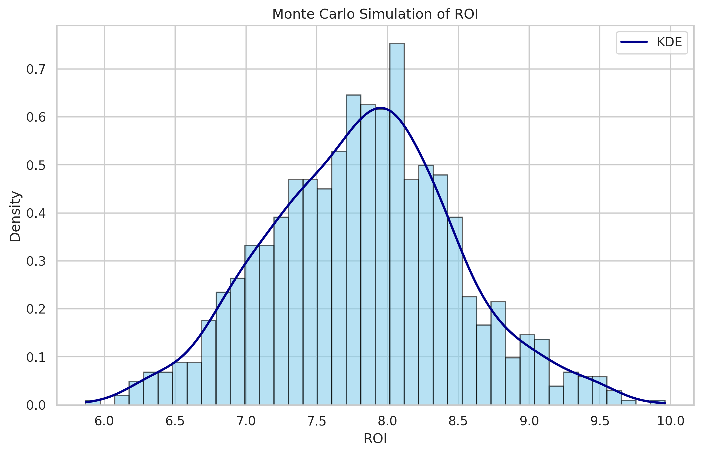

# Operational Strategy Simulator

A Streamlit app to simulate and optimize strategic initiatives based on cost, engineering constraints, and ARR impact. It enables users to select initiatives manually or use an automated knapsack-based optimizer, and visualize expected ROI distributions under uncertainty using Monte Carlo simulations.



---

## Live Demo

🔗 Try the app here:  
[https://operational-strategy-simulator-hxdqqzqz8i6s5kagkvryc3.streamlit.app](https://operational-strategy-simulator-hxdqqzqz8i6s5kagkvryc3.streamlit.app)

---

## Features

-  **Interactive budget and engineering constraints**
-  **Manual selection of initiatives with performance metrics**
-  **Optimized selection via linear programming (ARR or ROI)**
-  **Monte Carlo simulation to evaluate risk-adjusted ROI**
-  **Scenario modeling (Good / Neutral / Bad)**
-  **Clean UI with professional layout and summaries**

---

## Optimization Logic

Each initiative \( i \) is represented as a binary variable \( x_i \in \{0, 1\} \).

**Maximize ARR:**

\[
\max \sum_i a_i \cdot x_i
\]

**Maximize ROI (net gain):**

\[
\max \sum_i (a_i - c_i) \cdot x_i
\]

**Subject to:**

\[
\sum_i c_i \cdot x_i \leq \text{budget}
\]

\[
\sum_i d_i \cdot x_i \leq \text{engineering limit}
\]

---

## Visuals

### Monte Carlo ROI Simulation


---

## How to Run Locally

### 1. Clone the repository
```bash
git clone https://github.com/your-username/operational-strategy-simulator.git
cd operational-strategy-simulator
```
### 2. Install dependencies
```bash
pip install -r requirements.txt
```
### 2. Launch the app
```bash
streamlit run ui/streamlit_app.py
```
